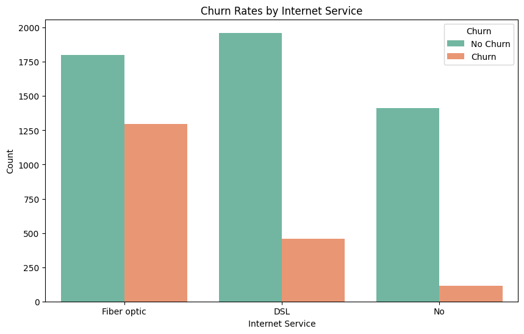
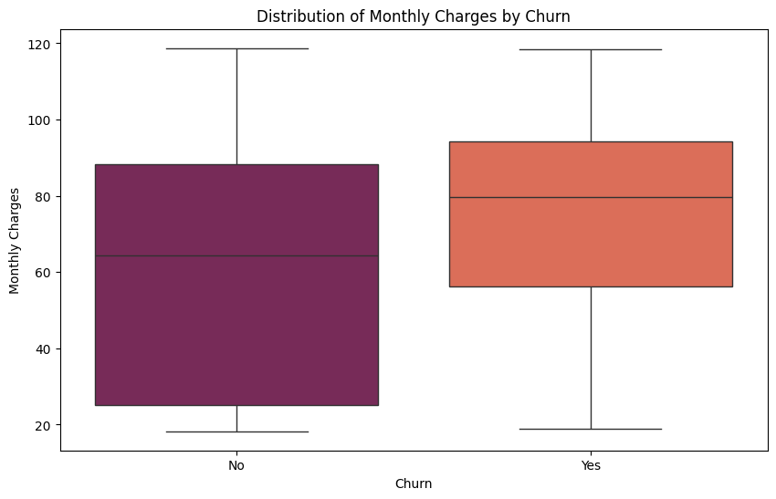
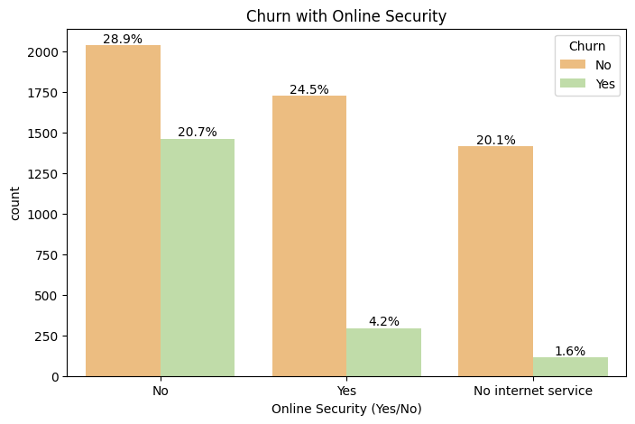
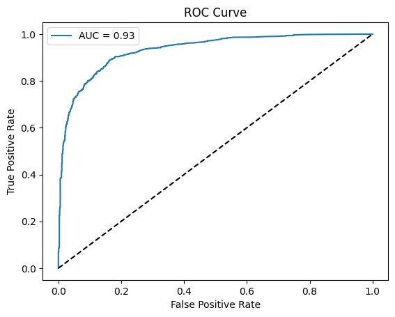

# Customer Churn Prediction Web Application

## Overview
This project is a full-stack web application designed to predict customer churn using a machine learning model. The application helps businesses identify customers who are likely to churn, allowing for targeted interventions. The project involves data preprocessing, exploratory data analysis (EDA), model building, and deployment.

**Project Duration:** February 2024 - May 2024

## Features
- **Backend**: Developed using Python and Flask, featuring RESTful APIs for data handling and model predictions.
- **Machine Learning Model**: Implemented a Random Forest Classifier achieving an accuracy of 87%.
- **Exploratory Data Analysis (EDA)**: Conducted EDA to identify key factors influencing customer churn.
- **Frontend**: Designed a responsive user interface using HTML, CSS, and JavaScript.
- **Deployment**: Hosted on Render for public access.

## Tech Stack
- **Backend**: Python, Flask
- **Frontend**: HTML, CSS, JavaScript
- **Machine Learning**: Scikit-learn, Pandas
- **Visualization**: Matplotlib, Seaborn
- **Deployment**: Render

## Setup and Installation

1. **Clone the repository:**
   ```bash
   git clone https://github.com/your-username/customer-churn-prediction.git
   cd customer-churn-prediction
2. **Install: dependencies:**
   ```bash
   pip install -r requirements.txt
3. **Run the Flask application:**
   ```bash
   python app.py
4. **Access the application:**
   Open your browser and navigate to http://localhost:5000.
## Exploratory Data Analysis (EDA)
Key insights from the EDA include the impact of internet service, monthly charges, and security features on customer churn. Below are some visualizations:
### 1. Churn by Internet Service


### 2. Churn by Monthly Charges


### 3. Churn with Online Security

## Model Performance 
The Random Forest Classifier was used for prediction, and the model's performance is summarized by the ROC curve below:
### ROC Curve

## Deployment
The application is deployed and publicly accessible at the following link: 
## How to use
1. Enter customer details in the provided form on the homepage.
2. Click the "Predict" button to get a prediction on whether the customer is likely to churn.
3. View the prediction result and consider interventions for customers predicted to churn.
## License 
This project is licensed under the MIT License - see the LICENSE file for details.
## Contact
For any inquiries or feedback, feel free to reach out via Alirajhabib@gmail.com
